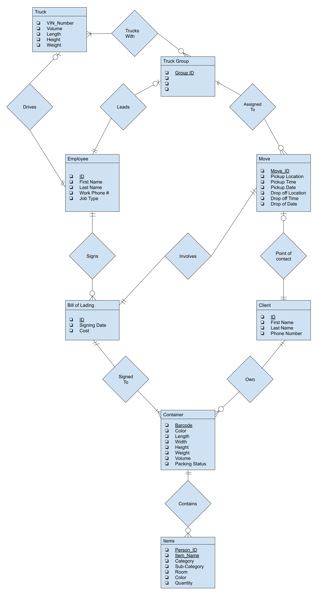

# CMSC 508 Semester Project Phase 1 Report
Charles Cutler and G Attard
 October 11, 2022

### *Table of Contents*
* [Introduction](#introduction)
* [Problem in the status quo](#problem-in-the-status-quo)
* [Environment](#environment)
* [Possible Users](#possible-users)
* [User Groups](#user-groups)
* [Entities Needed](#entities-needed)
* [20 Possible Queries](#20-possible-queries)
* [Entity Relationship Diagram](#entity-relationship-diagram)
* [Relational Schema](#relational-schema)

<small><i><a href='http://ecotrust-canada.github.io/markdown-toc/'>Table of contents generated with markdown-toc</a></i></small>

## Introduction
This report documents the deliverable items of the first phase for our final project in CMSC 508, "Introduction to Database Theory". This report provides answers to the effect of fullfing the following requirements: describing the problem in the status quo, a list of twenty distinct queries, an Entity-Relationship Diagram, translated relational schema, identified functional dependencies, normalized relation schema, and sample data.

## Problem in the status quo
Moving can be a hassle. Whether moving from house to house, house to dorm, or even just right across the street, keeping track of what you have and where it is quickly becomes a difficult task. When it comes time to unpack you can be left wondering, ``"Where are all my winter clothes?”`` or ``"Where are all my utensils?”``. Thus, it can be useful to pack the same stuff in the same box while reworking boxes that could have been packed better, especially when moving with any sort of regularity in a short period of time. However, taking the time to label or relabel all of your boxes and totes can be very tedious.

For example, team member G has moved multiple times and he understands the pain of keeping organized during the process of packing and unpacking. In his experience, the state of his families' belongings were organized in cardboard boxes labeled by general categories. These categories consisted of kitchen, garage, bath, master bedroom,  kids’ bedroom, etc. However, he and his family did not know exactly what the contents of each box were until they opened them and looked.

At the most basic level, a database design should start with items, then include which container/box items are placed into. Adding onto that a database might have the location of the container inside of the household. At the highest level the database may include the household/townhouse/apt location. Each item could include a description, quantity, color, and category.  Each container could include a description, color, and location. Each household could include an address and the people living in it. Therefore a database, to be described in much further detail should be designed with the appropriate "front-end" to provide assistance in solving the above issues.

## Environment 
Talk about mySQL. That’s the DDL + DML that’s where and how we will implement database. We will probably be working on the cloud or using azure but to be determined don’t worry about it as of yet

## Possible Users
To determine appropriate roles for the user groups of the database it was necessary to determine possible users. The roles were derived from the following hypothetical users:
* A user who owns stuff
* A user in charge of all of their families' stuff
* A user who drives the stuff
* A user in charge of all the drivers for a move
* A user in charge of all the drivers for all moves
* A user to coordinate with a household for pickup / drop off locations as well as who are the users in a household
* Database Admin

## User Groups
The following user groups and descriptions of their respective accesses are as follows:

* Household member
  * Can add items they own / delete items they own
  * Can add new containers
  * Can assign containers ownership to themselves / delete containers that they own
  * Can link items they own to a container they own
  * Can view items and containers they own
  * Can view vehicle information of vehicles in which containers they own stake in reside. CANNOT see driver information.
  * Can view destination information of the trucks with their containers
  
* Truck Driver
  * Can see descriptions of all containers in their trucks but NOT the specific ownership of them
  * Can see pickup information
  * Can see destination information
  * Can see / modify truck information. They can assign themselves to the truck they are driving 
  * Can see Bill of Lading for their assigned moves
  * Can see which trucking groups they are in
  * Can see which moves they are assigned to

* Distribution Manager
  * Can see all trucks and specifications of truck
  * Can see destinations of those trucks
  * Can see containers in each truck
  * Can see drivers of those trucks
  * Can see all trucking groups
  * Can see scheduled moves for all trucking groups
  * Can add new trucks
  * Can add new drivers
  * Can add new trucking groups and leaders of those groups
  * Can schedule a trucking group to a move

* Sales Representative
  * Can add new locations
  * Can delete old locations
  * Can assign locations to households
  * Can assign people to households
  * Can create new people and populate thier information
  * Can schedule moves with pickup / drop-off date, time, and location
  * Can add Bill of Lading to a given move
  * Can add a charge to a given move

## Entities Needed
Based on the above criterion, let the following entities be defined:

Data is to be stored about moves, employees, clients, trucks, trucking groups, bill of ladings, containers, and items. 

* The data stored for moves includes an unique id, the pickup date, the pickup time, the pickup location, the drop-off date, the drop-off time, the drop-off location, the point of contact, the "Bill of Lading" involved, and the assigned trucking group. 
* The data stored for employees includes employee id, employee name, employee job type, and, for those employees that are truck drivers, which truck they drive. Additionally it should be stored if an employee leads a trucking group. 
* The data stored for clients include an unique id, their name, their email, and their cell phone number. Additionally it should be stored whether they are the point of contact for a move. Lastly, for clients, it should be stroed what containers they own. 
* The data stored for trucks includes VIN number, truck volume, the length of the truck, the height of the truck, the weight of the truck, which emplyee drives the truck and which trucking groups the truck "trucks with". 
* The data stored for trucking groups should be the trucking group id, which employee leads each trucking group, which moves each trucking group is assigned to, and which trucks are in each trucking group. 
* The data stored for bill of ladings includes an unique id, the signing date, and the cost to move. Additionally, the containers involved with each bill of lading, the move each bill is involved with, and the employee who signs the bill should be stored. 
* The data stored for containers is the bar-code, color, length, width, height, weight, packing status, volume along with who is the owner and which bill of lading it is signed to. 
* The data stored for items includes owner ID, item name, category, subcategory, room, color, dimension, and quantity. Additionally the container the item gets packed in should be stored.

## 20 Possible Queries
Below are example queries, written in plain English, that could be asked of the database as it was described above.
* Who are the employees who are Sales Representatives?
* What are the heights of all trucks that have a height greater than 17 feet?
* Who are all the drivers, and their respective trucks, who are hauling during the month of June 2023?
* Display all of the moves that cost more than 10000 dollars and the point of contact for these moves.
* Where are all the locations for which a specific driver goes to for the month of July 2023?
* Have all the bill of ladings been uploaded for the moves happening during a specific week?
* For a specific move, are all the containers packed?
* Who is the head of household for the household that lives at a specific address?
* Display the boxes a specific person have with volume greater than 1 cubic foot that are not packed.
* Who are all the point of contacts for all of the moves happening in February 2023?
* What are all the states that a truck is going to in one year?
* What container did a specific person put their winter coat?
* What containers for a specific person contain items that belong in the Bedroom?
* What are all the containers for a household that contain items from the Kitchen?
* What are the license plate numbers and truck driver names for the trucks associated with a given move?
* What is the total weight for all containers for a household?
* How many days until my favorite toy arrives? ( For a specific person )
* Who has the largest container for a specific household?
* Does anyone in my household have an unpacked box I can use? AKA What are the unpacked boxes for my household?
* What are the moves that take longer than a 2 days to complete?

## Entity Relationship Diagram

## Relational Schema
Note that
* PK denotes attributes as the members of the primary key for a relation
* FK denotes attributes that are foreign keys for a relation
* *Italics* denotes the domain of an attribute

Now, from the above ER Diagram, the following relational schema can be defined:
* Truck( VIN_Number[PK]: *string*, Volume: *float32*, Length: *float32*, Height: *float32*, Weight: *float32* )
  * VIN_Number -> Volume, Length, Height, Weight

* Truck_Group( Truck_Group_ID[PK]: *string* )
  
* Employee( Employee_ID[PK]: *string*, Employee_First_Name: *string*, Employee_Last_Name: *string*,  Employee_Phone_Number: *string*, Job: *string* )
  * Employee_ID -> Employee_First_Name, Employee_Last_Name, Employee_Phone_Number, Job

* Bill_of_Lading( Bill_ID[PK]: *string*, Signing_Date: *DATE*, Cost: *float32* )
  * Bill_ID -> Signing_Date, Cost

* Client( Client_ID[PK]: *string*, Client_First_Name: *string*, Client_Last_Name: *string*, Client_Phone_Number: *string* )
  * Client_ID -> Client_First_Name, Client_Last_Name, Client_Phone_Number

* Move( Move_ID[PK]: *string*, Pickup_Location: *string*, Pickup_Time: *TIME*, Pickup_Date: *DATE*, Drop_Off_Location: *string*, Drop_Off_Time: *TIME*, Drop_Off_Date: *DATE* )
  * Move_ID -> Pickup_Location, Pickup_Time, Pickup_Date, Drop_Off_Location, Drop_Off_Time, Drop_Off_Date

* Container( Barcode[PK]: *string*, Color: *string*, Length: *float32*, Width: *float32*, Height: *float32*, Weight: *float32*, Volume: *float32*, Packing_Status: *boolean* )
  * Barcode -> Color, Length, Width, Height, Weight, Volume, Packing_Status

* Items( Person_ID[PK]: *string*, Item_Name[PK]: *string*, Category: *string*, Sub-category: *string*, Room: *string*, Color: *string*, Quantity: *integer* )
  * Person_ID, Item_Name -> Category, Sub-category, Room, Color, Quantity

* Drives( Employee_ID[PK, FK]: *string*, VIN_Number[FK]: *string* ) 

* Trucks_With( Truck_Group_ID[PK, FK]: *string*, VIN_Number[PK, FK]: *string* )

* Leads( Employee_ID[PK, FK]: *string*, Truck_Group_ID[FK]: *string* )
  * Employee_ID -> Truck_Group_ID

* Signs( Bill_ID[PK, FK]: *string* , Employee_ID[FK]: *string* )
  * Bill_ID -> Employee_ID 

* Assigned_To( Move_ID[PK, FK]: *string*, Truck_Group_ID[FK]: *string* )
  * Move_ID -> Truck_Group_ID

* Involves( Move_ID[PK, FK]: *string*, Bill_ID[FK]: *string* )
  * Move_ID -> Bill_ID

* Point_of_Contact( Move_ID[PK, FK]: *string*, Client_ID[FK]: *string* )
  * Move_ID -> Client_ID

* Signed_To( Barcode[PK, FK]: *string*, Bill_ID[FK]: *string* )
  * Barcode -> Bill_ID

* Own( Barcode[PK, FK]: *string*, Client_ID[FK]: *string* )
  * Barcode -> Client_ID

* Contains( Person_ID[PK, FK]: *string*, Item_Name[PK, FK]: *string*, Barcode[FK]: *string* )
  * Person_ID, Item_Name -> Barcode

## Thank You!

