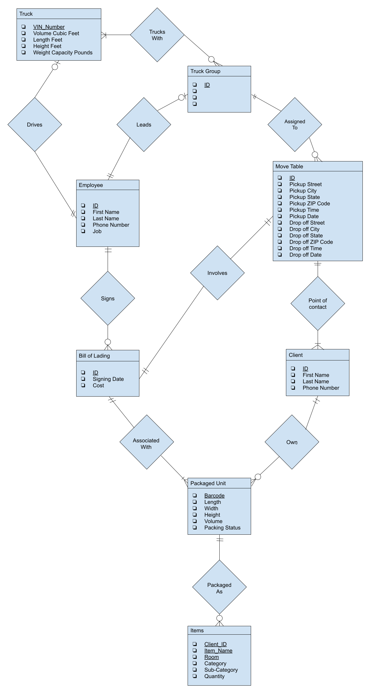
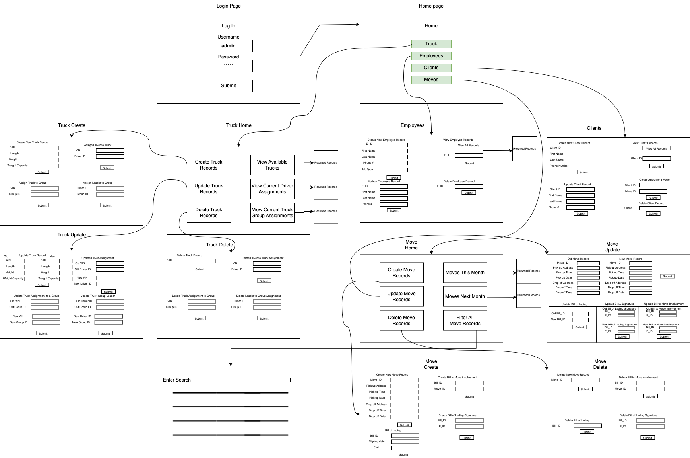
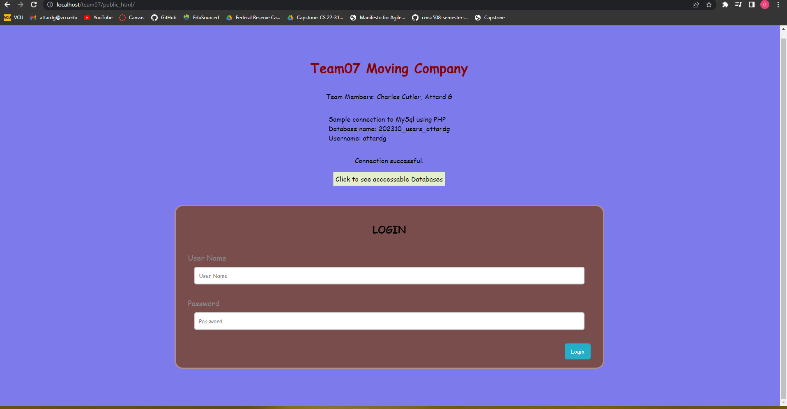

# CMSC 508 Semester Project Phase 2 Report
Charles Cutler and G Attard
 December 14, 2022

<small><i><a href='http://ecotrust-canada.github.io/markdown-toc/'>Table of contents generated with markdown-toc</a></i></small>

## Introduction
This report documents the deliverable items of the second phase for our final project in CMSC 508, "Introduction to Database Theory". This report provides answers to the effect of fullfilling the following requirements: Project Documentation, Database Implementation, Website Implemnetation, and a Video Presentation.

## Problem in the status quo
Moving can be a hassle. Whether moving from house to house, house to dorm, or even just right across the street, keeping track of what you have and where it is quickly becomes a difficult task. When it comes time to unpack you can be left wondering, ``"Where are all my winter clothes?”`` or ``"Where are all my utensils?”``. Thus, it can be useful to pack the same stuff in the same box while reworking boxes that could have been packed better, especially when moving with any sort of regularity in a short period of time. However, taking the time to label or relabel all of your boxes can be very tedious.

For example, team member G has moved multiple times and he understands the pain of keeping organized during the process of packing and unpacking. In his experience, the state of his family's belongings were organized in cardboard boxes labeled by general categories. These categories consisted of kitchen, garage, bath, master bedroom,  kids’ bedroom, etc. However, he and his family did not know exactly what the contents of each box were until they opened them and looked.

At the most basic level, a database design should start with items, then include which box items are placed into. Adding onto that a database might have the location of the container inside of the household. At the highest level the database may include the household/townhouse/apt location. Each item could include a description, quantity, color, and category.  Each container could include a description, color, and location. Each household could include an address and the people living in it. Therefore a database, to be described in much further detail should be designed with the appropriate "front-end" to provide assistance in solving the above issues.

## Environment 
mySQL is the DDL + DML through which we will implement the database. We will probably be working on the cloud or using azure but it is to be determined.

## Hypothetical Users
To determine appropriate roles for the user groups of the database it was necessary to determine possible users. The roles were derived from the following hypothetical users:
* A user who owns items
* A user who drives items
* A user in charge of all the drivers for a move
* A user in charge of all the drivers for all moves
* A user to coordinate with a household for pickup / drop off locations 
* Database Admin

## User Groups
The following user groups and descriptions of their respective accesses are as follows:

* Household member
  * Can add items they own / delete items they own
  * Can add new packaged units
  * Can assign packaged units ownership to themselves / delete packaged units that they own
  * Can link items they own to a packaged unit they own
  * Can view items and packaged unit they own
  
* Truck Driver
  * Can see descriptions of all packaged units in their trucks but NOT the specific ownership of them
  * Can see pickup information
  * Can see destination information
  * Can see / modify truck information. They can assign themselves to the truck they are driving 
  * Can see Bill of Lading for their assigned moves
  * Can see which trucking groups they are in
  * Can see which moves they are assigned to

* Distribution Manager
  * Can see all trucks and specifications of truck
  * Can see destinations of those trucks
  * Can see containers in each truck
  * Can see drivers of those trucks
  * Can see all trucking groups
  * Can see scheduled moves for all trucking groups
  * Can add new trucks
  * Can add new drivers
  * Can add new trucking groups and leaders of those groups
  * Can schedule a trucking group to a move

* Sales Representative
  * Can add new locations
  * Can delete old locations
  * Can assign locations
  * Can assign people 
  * Can create new people and populate their information
  * Can schedule moves with pickup / drop-off date, time, and location
  * Can add Bill of Lading to a given move
  * Can add a charge to a given move

## Entities Needed
Based on the above criterion, let the following entities be defined:

Data is to be stored about moves, employees, clients, trucks, trucking groups, bill of ladings, packaged units, and items. 

* The data stored for moves includes an unique id, the Pickup Street, the Pickup City, the Pickup State, the Pickup ZIP Code, the Pickup Time, the Pickup Date, the Drop off Street, the Drop off City, the Drop off State, the Drop off ZIP Code, the Drop off Time, the Drop off Date, the people associated with the move, the "Bill of Lading" involved, and the assigned trucking group. 
* The data stored for employees includes an employee ID, First Name, Last Name, Phone Number, their Job and, for those employees that are truck drivers, which truck they drive. Additionally it should be stored if an employee leads a trucking group. 
* The data stored for clients include an unique ID, First Name, Last Name, and their Phone Number. Additionally it should be stored which move they are part. Lastly, for clients, it should be stored what packaged units they own. 
* The data stored for trucks includes VIN_Number, the volume in cubic feet, the length in feet, the height in feet, and the weight capacity in pounds. Additonally, it should be stored which employee drives the truck and which trucking groups the truck "trucks with". 
* The data stored for trucking groups should be the trucking group id, which employee leads each trucking group, which moves each trucking group is assigned to, and which trucks are in each trucking group. 
* The data stored for bill of ladings includes an unique id, the signing date, and the cost to move. Additionally, the packaged units involved with each bill of lading, the move each bill is involved with, and the employee who signs the bill should be stored. 
* The data stored for packaged units is the barcode, length, width, height, packing status, and volume along with who is the owner and which bill of lading it is signed to. Additionally we shoudl stire what items are contained, if applicable, to each package unit.
* The data stored for items includes client ID, item name, room, category, subcategory, quantity. Additionally we should store the packaged unit the item gets packed into.

## 20 Possible Queries
The RAW queries to the below 20 queries in English can be found in the DML file in this repository. They are written in MySQL.
Below are example queries, written in plain English, that could be asked of the database as it was described above.
* Who are the employees who are Sales Representatives?
* What are the heights of all the trucks that have a length greater than 17 feet?
* Who are all the drivers and their respective trucks, who are hauling during the month of June 2023?
* Display all of the moves that cost more than 8500 dollars and the points of contact for these moves.
* Where are all the locations for which a specific driver goes to in 2023?
* Have all the bill of ladings been uploaded for the moves happening during a specific month?
* For a specific move, are all the packaged units packed?
* Which employees lead truck groups involved in moves during December 2023?
* Display the packaged units for a specific client that have a volume greater than 1 cubic foot and are not packed.
* Who are all the point of contacts for all of the moves happening in February 2023?
* What are all the states that a truck is going to in one year?
* What packaged unit did a specific client put their winter coat?
* What containers for a specific client contain items that belong in the Bedroom?
* What are all the packaged units for a move that are from the Kitchen?
* What are the VIN numbers and truck driver names for the trucks associated with a given move?
* Which room, for a specific move, has the most stuff?
* How many days until a favorite jacket arrives? ( For a specific client )
* Who has the largest container for a specific address?
* What is the average cost per packaged unit to move my stuff ( for a specific move )
* Which moves that take longer than 4 days to complete?

## Entity Relationship Diagram

## Relational Schema
Note that
* PK denotes attributes as the members of the primary key for a relation
* FK denotes attributes that are foreign keys for a relation
* *Italics* denotes the domain of an attribute

Now, from the above ER Diagram, the following relational schema can be defined:
* Truck( VIN_Number[PK]: *string*, Volume_Cubic_Feet: *int*, Length_Feet: *int*, Height_Feet: *float*, Weight_Capacity_Pounds: *int* )
  * VIN_Number -> Volume_Cubic_Feet, Length_Feet, Height_Feet, Weight_Capacity_Feet

* Truck_Group( Truck_Group_ID[PK]: *string* )
 
* Employee( Employee_ID[PK]: *string*, Employee_First_Name: *string*, Employee_Last_Name: *string*,  Employee_Phone_Number: *string*, Employee_Job: *string* )
  * Employee_ID -> Employee_First_Name, Employee_Last_Name, Employee_Phone_Number, Employee_Job

* Bill_of_Lading( Bill_ID[PK]: *string*, Signing_Date: *DATE*, Cost: *float* )
  * Bill_ID -> Signing_Date, Cost

* Client( Client_ID[PK]: *string*, Client_First_Name: *string*, Client_Last_Name: *string*, Client_Phone_Number: *string* )
  * Client_ID -> Client_First_Name, Client_Last_Name, Client_Phone_Number

* Move_Table( Move_ID[PK]: *string*, Pickup_Street: *string*, Pickup_City: *string*, Pickup_State: *string*, Pickup_ZipCode: *string*, Pickup_Time: *TIME*, Pickup_Date: *DATE*, Drop_Off_Street: *string*, Drop_Off_City: *string*, Drop_Off_State: *string*, Drop_Off_ZipCode: *string*, Drop_Off_Time: *TIME*, Drop_Off_Date: *DATE* )
  * Move_ID -> Pickup_Street, Pickup_City, Pickup_State, Pickup_ZIPCode, Pickup_Time, Pickup_Date, Drop_Off_Street, Drop_Off_City, Drop_Off_State, Drop_Off_ZIPCode, Drop_Off_Time, Drop_Off_Date

* Packaged_Unit( Barcode[PK]: *string*, Length: *float*, Width: *float*, Height: *float*, Volume: *float*, Packing_Status: *boolean* )
  * Barcode -> Length, Width, Height, Volume, Packing_Status

* Items( Client_ID[PK]: *string*, Item_Name[PK]: *string*, Room[PK]: *string*, Category: *string*, Sub-category: *string*, Quantity: *integer* )
  * Client_ID, Item_Name, Room -> Category, Sub-category, Quantity

* Drives( Employee_ID[PK, FK]: *string*, VIN_Number[FK]: *string* ) 

* Trucks_With( Truck_Group_ID[PK, FK]: *string*, VIN_Number[PK, FK]: *string* )

* Leads( Employee_ID[PK, FK]: *string*, Truck_Group_ID[FK]: *string* )
  * Employee_ID -> Truck_Group_ID

* Signs( Bill_ID[PK, FK]: *string* , Employee_ID[FK]: *string* )
  * Bill_ID -> Employee_ID 

* Assigned_To( Move_ID[PK, FK]: *string*, Truck_Group_ID[FK]: *string* )
  * Move_ID -> Truck_Group_ID

* Involves( Move_ID[PK, FK]: *string*, Bill_ID[FK]: *string* )
  * Move_ID -> Bill_ID

* Point_of_Contact( Move_ID[PK, FK]: *string*, Client_ID[FK]: *string* )
  * Move_ID -> Client_ID

* Associated_With( Barcode[PK, FK]: *string*, Bill_ID[FK]: *string* )
  * Barcode -> Bill_ID

* Own( Barcode[PK, FK]: *string*, Client_ID[FK]: *string* )
  * Barcode -> Client_ID

* Packaged_As( Client_ID[PK, FK]: *string*, Item_Name[PK, FK]: *string*, Item_Room[PK, FK]: *string*, Barcode[FK]: *string* )
  * Client_ID, Item_Name, Item_Room -> Barcode

## Normalization
This database was well designed and the relational schema generated from the ERD are already in 4NF

## Sample Data

The sample data that we created for this project can be found in two places.
1) In the 508 - Sample Data.xlsx spreadsheet as an "Editable" format
2) In the DDL file as mMySQL "Insert" statements

## Website Design
Attached below is a diagram of how we planned to implement our website to allow for a manager to do the Create, Read, Update, and Delete ( CRUD ) actions on the data.

## What we learned

Throughout the lifecycle of this project we learned three main things:
1) Constant communication is necessary for success. We, as a team, met consistently throughout the semester. At these meetings, we made sure to plan our tasks for the week as well as make sure we had a good timeline. However, as the semester got harder and we were not able to meet as frequently, we found it much harder to get tasks completed and stay on track. 

2) Writing SQL code is the best way to get better at SQL code. As straightforward as this sounds it can appear under-appreciated. This project required writing advanced-level SQL code. In the beginning, we struggled but the more code we wrote, the better we got. This cannot be overstated, write SQL and you WILL get better.

3) Look at your data. As we made data, built of DDL file, and began working with our 20 queries we realized that some of the initial choices we made for data types did not make any sense. Our advice would be to really take a deep look at your data, make sure it makes logical sense, and constantly make improvements to it as you need to.

## Semester Project Improvements

In our opinion, the project could be improved if we learned more about SQL and working in SQL earlier. Many of the concepts used in the second phase we did not learn until the last 1/3 of the semester making for some late nights. Additionally, seeing the sample websites sooner and getting to play around with the web development side of this project sooner would have been useful in developing a better website. Additionally, it would have allowed us more time to ask questions and really dig in deep with learning how to communicate with a backend and database.

## Video Link

https://youtu.be/tpKnq9Z7OZ4

## Thank You!

